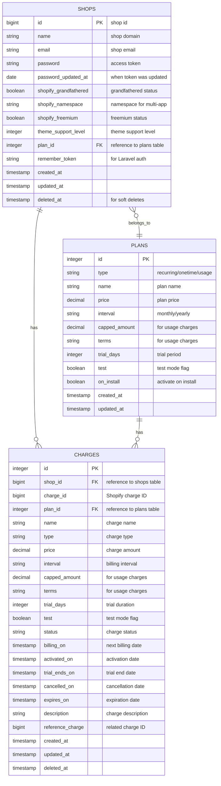

```mermaid
erDiagram
    SHOPS ||--o{ CHARGES : has
    SHOPS }o--|| PLANS : belongs_to
    PLANS ||--o{ CHARGES : has

    SHOPS {
        bigint id PK "shop id"
        string name "shop domain"
        string email "shop email"
        string password "access token"
        date password_updated_at "when token was updated"
        boolean shopify_grandfathered "grandfathered status"
        string shopify_namespace "namespace for multi-app"
        boolean shopify_freemium "freemium status"
        integer theme_support_level "theme support level"
        integer plan_id FK "reference to plans table"
        string remember_token "for Laravel auth"
        timestamp created_at
        timestamp updated_at
        timestamp deleted_at "for soft deletes"
    }

    PLANS {
        integer id PK
        string type "recurring/onetime/usage"
        string name "plan name"
        decimal price "plan price"
        string interval "monthly/yearly"
        decimal capped_amount "for usage charges"
        string terms "for usage charges"
        integer trial_days "trial period"
        boolean test "test mode flag"
        boolean on_install "activate on install"
        timestamp created_at
        timestamp updated_at
    }

    CHARGES {
        integer id PK
        bigint shop_id FK "reference to shops table"
        bigint charge_id "Shopify charge ID"
        integer plan_id FK "reference to plans table"
        string name "charge name"
        string type "charge type"
        decimal price "charge amount"
        string interval "billing interval"
        decimal capped_amount "for usage charges"
        string terms "for usage charges"
        integer trial_days "trial duration"
        boolean test "test mode flag"
        string status "charge status"
        timestamp billing_on "next billing date"
        timestamp activated_on "activation date"
        timestamp trial_ends_on "trial end date"
        timestamp cancelled_on "cancellation date"
        timestamp expires_on "expiration date"
        string description "charge description"
        bigint reference_charge "related charge ID"
        timestamp created_at
        timestamp updated_at
        timestamp deleted_at
    }
```